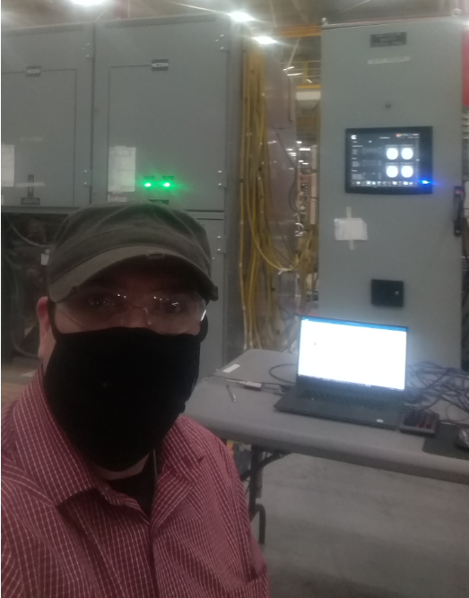
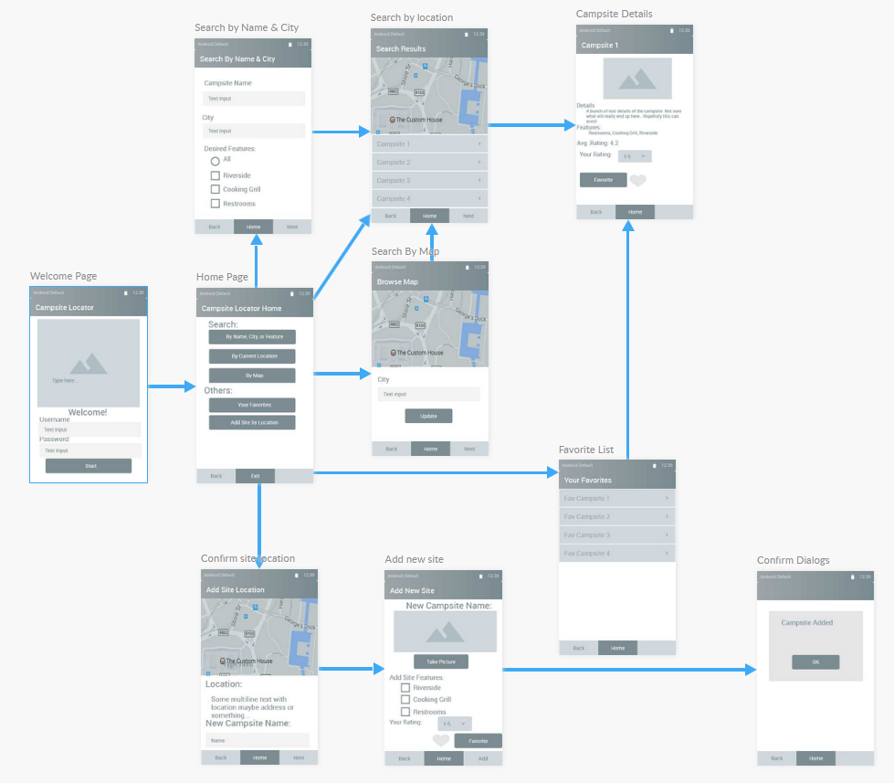
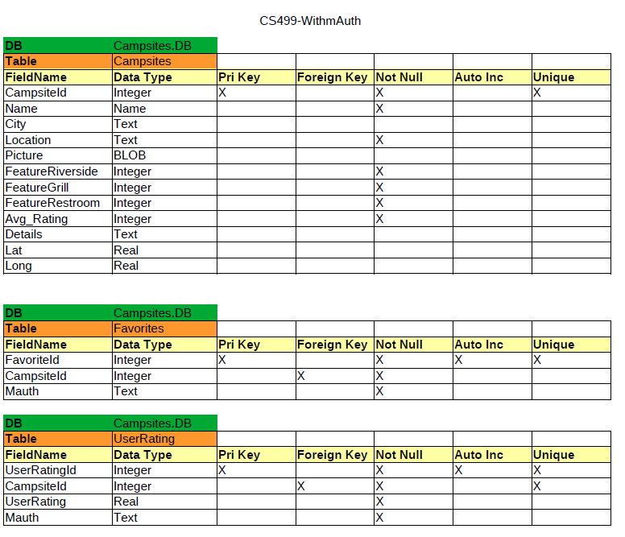
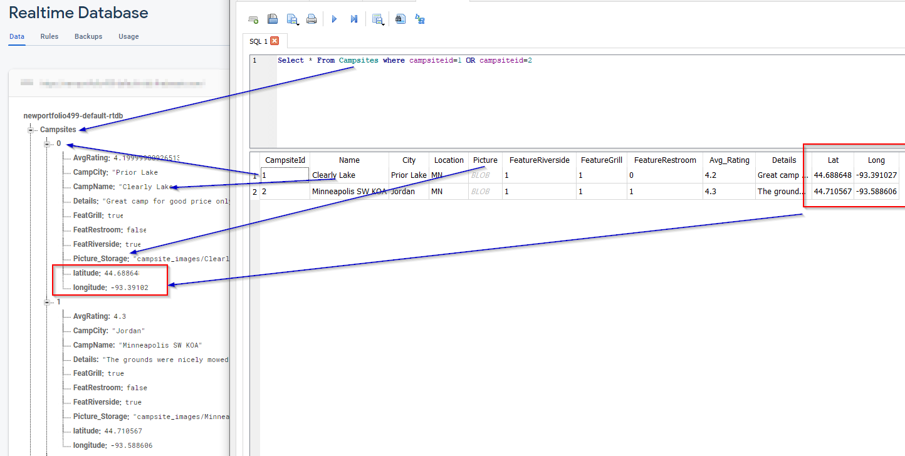

## Professional Self-Assessment
Hello!  I am a computer science student with a background in electrical engineering and industrial automation.  My goal for attending  a computer science program was to expand my horizons and learn more about software and its capabilities.  

I started this program with very little knowledge of programming as it is traditionally known.  The world of PLC programming is simplified to graphical represenations of boolean logic.  Still the problem solving element exists.  I wanted to see if I could take those problem sovling skills and learn something new.  This portfolio outlines the work I have done in two areas.

The first area is a code review of what I would critique on C source code.  I took code from the github repository for the original doom source code located on github.  I am not a video game developer and though it would be interesting to see if I could understand how the cheat codes worked in doom.

The second are is an android application I worked on from a mobile development class and detailing the steps from going from an internal database to placing that database into firebase.  The goal was to show the proof of concept of creating an adroid app with centralized location for data (authentication, app, and user data). 

## Code Review

The doom video source code I reviewed is located here [Doom 1993](https://github.com/id-Software/DOOM)

The doom video source code I reviewed is broken out into separate videos to fit with githubs file size limitations.
- [Part 1](Code_Review_Videos/mleith785_Cs499_Code_Review-1.m4v)
- [Part 2](Code_Review_Videos/mleith785_Cs499_Code_Review-2.m4v)
- [Part 3](Code_Review_Videos/mleith785_Cs499_Code_Review-3.m4v)
- [Part 4](Code_Review_Videos/mleith785_Cs499_Code_Review-4.m4v)
- [Part 5](Code_Review_Videos/mleith785_Cs499_Code_Review-5.m4v)
- [Part 6](Code_Review_Videos/mleith785_Cs499_Code_Review-6.m4v)

## Android Artifact - Design and Database
This artifact demonstrated learning about databases and mobile development.  

The source code I had used to create the android appis located here as a public repository. [Campsite Locator](https://github.com/mleith785/FirebaseDB).
### UI Design
The original step in creating the app was to mock up a wireframe of the behavior.  This image shows the wireframe I designed based on the requirements of the course.   

The program used for achieving the wireframe was [FluidUi](Images/https://www.fluidui.com).
The UI design was not difficult to achieve using basic activities for each screen with listeners for button presses.  The google documentation was used to help me get over implementing Map support, recycler views, and camera integration.  

### Original Database - SQL Lite
The project utilized an SQL lite database embedded in the program.  This database would be downloaded onto the phone as an asset.  This was a good learning opportunity for the class, but not the best for an app with multiple users.  The original schema for this database is shown below.

A quick demo of the application working with SQL Lite is shown in this video.

[Original Campsite SQL Lite](Android_App_Videos/Original_SQL_Android_Demo_Smaller_size.mp4)

You can use the [editor on GitHub](https://github.com/mleith785/mleith785.github.io/edit/main/index.md) to maintain and preview the content for your website in Markdown files.

Whenever you commit to this repository, GitHub Pages will run [Jekyll](https://jekyllrb.com/) to rebuild the pages in your site, from the content in your Markdown files.

### Firebase Database - NoSQL
The firebase version of the Campsite locator app required using NoSQL.  I ended up exporting the SQL lite database I had and turned it into documents for the queries.  The picture below shows a snippet of how the schema changed from SQL to NoSQL.  In general, I made new NoSQL paths that corresponded to the original SQL tables.  I removed all primary keys from the SQL database and used the document identifier/key as the replacement in NoSQL.  This ID was used to identify a unique document/record in the campsite database.

